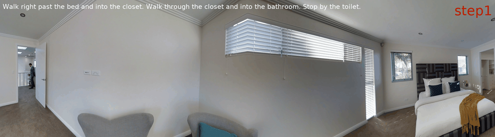

<div align="center">

<h1><span style="background: linear-gradient(to right, #007BA7, #99B5D2); -webkit-background-clip: text; color: transparent;font-style: italic;"> CoNav </span>: Collaborative Cross-Modal Reasoning for Embodied Navigation </h1>

<div>
    <a href='https://abdd.top' target='_blank'>Haihong Hao<sup>🍕</sup></a>;
    <a href='https://mingfei.info' target='_blank'>Mingfei Han<sup>🌭</sup></a>;
    <a href='https://scholar.google.com/citations?hl=en&user=RLAgwBkAAAAJ' target='_blank'>Changlin Li<sup>🍔</sup></a>;
    <a href='https://www.zhihui.li/' target='_blank'>Zhihui Li<sup>🍕</sup></a>;
    <a href='https://www.xiaojun.ai/' target='_blank'>Xiaojun Chang<sup>🍕</sup></a>
</div>
<sup>🍕</sup>University of Science and Technology of China
<sup>🌭</sup>MBZUAI
<sup>🍔</sup>Stanford University

<br>


<p align="center">
    <br>
</p>
</div>

<div>
    <a href='https://arxiv.org/abs/2505.16663' target='_blank'></a>
    <a href="https://opensource.org/licenses/MIT"></a>
</div>


## 🍹 Abstract

Embodied navigation demands comprehensive scene understanding and precise spatial reasoning. While image-text models excel at interpreting pixel-level color and lighting cues, 3D-text models capture volumetric structure and spatial relationships. However, unified fusion approaches that jointly fuse 2D images, 3D point clouds, and textual instructions face challenges in limited availability of triple-modality data and difficulty resolving conflicting beliefs among modalities. In this work, we introduce CoNav, a collaborative cross-modal reasoning framework where a pretrained 3D-text model explicitly guides an image-text navigation agent by providing structured spatial-semantic knowledge to resolve ambiguities during navigation. Specifically, we introduce Cross-Modal Belief Alignment, which operationalizes this cross-modal guidance by simply sharing textual hypotheses from the 3D-text model to the navigation agent. Through lightweight fine-tuning on a small 2D-3D-text corpus, the navigation agent learns to integrate visual cues with spatial-semantic knowledge derived from the 3D-text model, enabling effective reasoning in embodied navigation. CoNav achieves significant improvements on four standard embodied navigation benchmarks (R2R, CVDN, REVERIE, SOON) and two spatial reasoning benchmarks (ScanQA, SQA3D). Moreover, under close navigation Success Rate, CoNav often generates shorter paths compared to other methods (as measured by SPL), showcasing the potential and challenges of fusing data from different modalities in embodied navigation.

## 🍻 TODOs

- [ ] Release CoNav pretraining code.
- [ ] Release CoNav Cross-Modal Belief Alignment fine-tuning code.
- [ ] Release models weights.
- [ ] Release data preparation scripts.

## 🥂 Acknowledgements

We extend our gratitude to MatterPort 3D for their valuable contributions to the open-source platform and community.

We also acknowledge the significant benefits of using [DUET](https://github.com/cshizhe/VLN-DUET), [ScaleVLN](https://github.com/wz0919/ScaleVLN) and [NaviLLM](https://github.com/zd11024/NaviLLM) in this work. Our thanks go out to the creators of these outstanding projects.

## 🍺 Citation

If you find this work helpful, please consider citing:

```bibtex
@article{hao2025conav,
  title={CoNav: Collaborative Cross-Modal Reasoning for Embodied Navigation},
  author={Hao, Haihong and Han, Mingfei and Li, Changlin and Li, Zhihui and Chang, Xiaojun},
  journal={arXiv preprint arXiv:2505.16663},
  year={2025}
}
```
<div style="width: 100%; display: flex; justify-content: center; align-items: center; margin: 20px 0;">
    <span style="font-size: 1.2em; font-weight: bold; color: #444;">
        Thank you (.❛ ᴗ ❛.)
    </span>
</div>

## 📖 Example 


